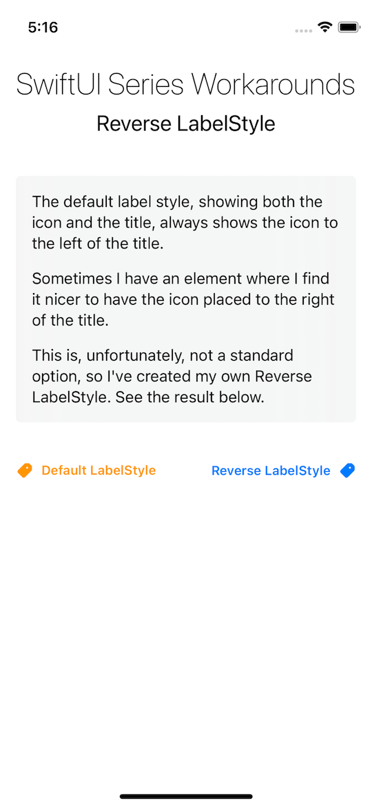

# SwiftUI Series - Workarounds

This is my entry for [The SwiftUI Series - Workarounds challenge](https://www.swiftuiseries.com/workarounds).  
A small, and simple label style.

## Reverse LabelStyle
- The default label style, showing both the icon and the title, always shows the icon to the left of the title.
- Sometimes I have an element where I find it nicer to have the icon placed to the right of the title.
- This is, unfortunately, not a standard option, so I've created my own Reverse LabelStyle. See the result below and the code in the project.

