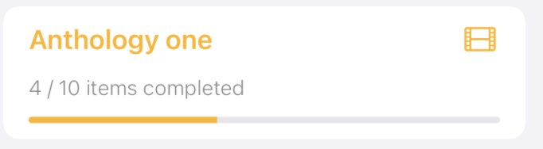
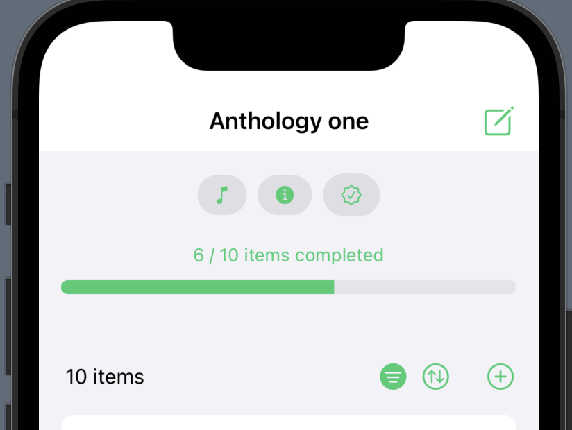

# SwiftUI Series - Workarounds

This is my entry for [The SwiftUI Series - Workarounds challenge](https://www.swiftuiseries.com/workarounds).  
A progress view style to customize the size and colors of the `ProgressView`.

## Bar ProgressViewStyle
I believe the default progress view is pretty limited in its ability to change the bar's design, like the colors or height/thickness and such. That is why I decided to create a `ProgressViewStyle` where you can customize these properties.

I made this when I used the progress view for each item in a list. The default style was fine for that. But in the detail view of an item I wanted a thicker, more pronounced, progress view, but couldn't find a way of getting it to look that way with the default style.

  

