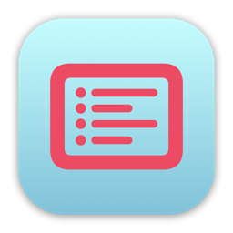

# SwiftUI Series - macOS

This is my entry for [The SwiftUI Series - macOS challenge](https://www.swiftuiseries.com/macos). 


## Indexator



I sometimes forget what files I have inside certain folders (inside other folders) and want to see a whole list of all the folder's contents.  
I know you can easily do this with a terminal command or Automator, but I like having a UI where I can immediately see the results of certain options and don't have to look up what commands to use in terminal (one of the reasons I don't like use terminal much).
  
So I've created **Indexator**, a macOS app that will give you an index of all files and/or folders inside a specified folder right there on the screen, but you can also save the results as text file.

## Highlights
### FileManager
`FileManager` is the most important API in the app. It does all the work of getting the contents of the folder, and yet all it takes is a few lines of code once you have the folder URL and the options.
``` swift
public extension FileManager {
    func indexateFolder(at url: URL, options: DirectoryEnumerationOptions) -> [URL] {
        let enumerator = enumerator(at: url, includingPropertiesForKeys: nil, options: options)
        let urls = enumerator?.allObjects as? [URL]
        
        return urls ?? []
    }
}
```

### NSWorkspace
For two of the post-saving options I use `NSWorkspace`. One to show the saved index file in the **Finder**, and the other to open the file in the default text editor.
``` swift
let workspace = NSWorkspace.shared
if postSavingOptions.contains(.finder)   { workspace.activateFileViewerSelecting([url]) }
if postSavingOptions.contains(.openFile) { workspace.open(url) }
```

### SwiftUI (obviously)
The two most important modifiers I use in this app are:  

- `fileImporter(isPresented:allowedContentTypes:onCompletion:)`
- `fileExporter(isPresented:document:contentType:defaultFilename:onCompletion:)`

These allow you to choose a folder to indexate, and where to save the index file, respectively.  
For more control over the panels I could have used `NSOpenPanel` and `NSSavePanel`, but for the purposes of this app, I find that the modifiers above work just fine.  

I only had to create a struct called `IndexFile` that conforms to the `FileDocument` protocol in order to use the `fileExporter` modifier, but that turned out to be easier than I thought thanks to [Paul Hudson's article](https://www.hackingwithswift.com/quick-start/swiftui/how-to-export-files-using-fileexporter).

## Next Steps
I implemented a couple of keyboard shortcuts, but have not added those actions as menu items in the menu bar of the application.

Another feature I would like to implement, is a **Finder extension**, where the context menu of any folder in Finder has a menu item that launches the **Indexator** app with the corresponding folder already selected. I need to do a bit more research into that, test things out, so there is not enough time for me to implement that before the deadline.

## AppIcon
I know the icon's colors are not the best combination, but at least it's not a common combination, besides, this icon is for development only.  

*Do I get bonus points for using Bakery for the app icon 😉???*
